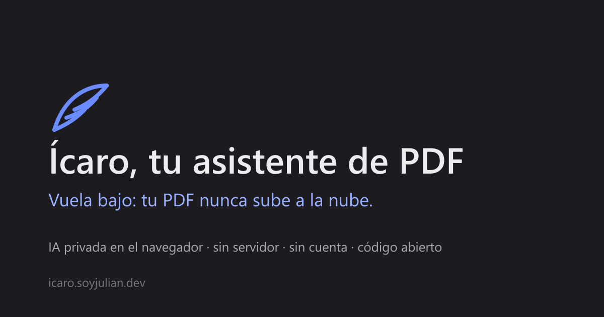

# Ícaro, tu asistente de PDF

Suelta un PDF, pregúntale en lenguaje natural y te responde citando las páginas. **Todo corre en tu navegador**: ni el documento ni las preguntas salen de tu equipo. No hay servidor, ni cuenta, ni analítica; Vercel solo sirve ficheros estáticos y se despliega gratis.

**→ [icaro.soyjulian.dev](https://icaro.soyjulian.dev)** · [English below](#english)



> Ícaro voló demasiado cerca del sol. Este no sube a la nube.

## Qué hace

- **Lee el PDF** con pdf.js dentro de un Web Worker y lo trocea por páginas (~350 tokens por trozo, sin mezclar páginas).
- **Lo indexa** con un modelo de embeddings multilingüe y guarda trozos y vectores en IndexedDB: la segunda vez que sueltas el mismo fichero es instantáneo.
- **Busca** los cinco trozos más parecidos a tu pregunta (coseno sobre un `Float32Array`, sin librerías de vectores).
- **Responde** con un modelo pequeño en streaming, solo con esos trozos, y cita las páginas así: `[p. 12]`. Si no está en el documento, lo dice.
- **Visor integrado**: el PDF a la derecha, con salto a la página al pulsar una cita. Selecciona un texto → «Mencionar» y viaja con tu siguiente pregunta.
- **Chats guardados** en `localStorage`, con su documento; barra lateral plegable; tema oscuro y claro; español e inglés.
- Traza de actividad al estilo agente: qué está leyendo, descargando o indexando, y las fuentes de cada respuesta.

## Modelos y requisitos

Se descargan de Hugging Face la primera vez que sueltas un PDF (no al abrir la página) y el navegador los cachea.

| Tarea | Modelo | Peso | Notas |
| --- | --- | --- | --- |
| Embeddings | [`Xenova/multilingual-e5-small`](https://huggingface.co/Xenova/multilingual-e5-small) | ≈ 120 MB | 384 dims, multilingüe, q8. Prefijos `query:` / `passage:`. |
| Generación | [`onnx-community/Qwen2.5-0.5B-Instruct`](https://huggingface.co/onnx-community/Qwen2.5-0.5B-Instruct) | ≈ 400 MB | Responde bien en español para su tamaño, q4. |
| Generación (rápido) | [`HuggingFaceTB/SmolLM2-360M-Instruct`](https://huggingface.co/HuggingFaceTB/SmolLM2-360M-Instruct) | ≈ 250 MB | Más ligero, peor en español. Para equipos con poca memoria. |

Recomendado: Chrome o Edge con **WebGPU** y 4 GB de RAM libres. Sin WebGPU funciona con WebAssembly (Firefox, Safari), pero la generación es mucho más lenta. La aceleración se puede elegir en el menú del modelo.

## Cómo funciona

1. `pdf.worker` extrae el texto por página y lo trocea (`lib/chunk.ts`).
2. `embed.worker` calcula un vector por trozo; se guardan en IndexedDB con clave `sha256(fichero)` (`lib/cache.ts`).
3. Cada pregunta se embebe y `lib/search.ts` saca los 5 trozos más parecidos.
4. `lib/prompt.ts` monta el prompt (system + dos ejemplos + fragmentos) y `llm.worker` genera en streaming.
5. La respuesta se pinta token a token; las citas `[p. N]` son clicables y abren el visor en esa página.

Con un 0.5B, decirle «cita así: [p. 12]» a secas hace que responda solo `[3]`; enseñárselo con dos turnos de ejemplo funciona. Y si aun así no cita, se añade la página del trozo con más palabras en común (`ensureCitation`), así que la cita siempre apunta a un fragmento recuperado de verdad.

## Privacidad

Abre la pestaña Red: durante la primera carga verás descargas de `huggingface.co` (los pesos) y después ninguna petición. El runtime WASM de ONNX y los CMaps de pdf.js se sirven desde el propio dominio (`scripts/copy-assets.mjs` los copia de `node_modules` en build), no desde un CDN ajeno. Cabeceras COOP/COEP en `vercel.json` para el WASM multihilo.

## Limitaciones

- Es un modelo de 500 M de parámetros: puede confundir datos cercanos en el texto. Las citas están para comprobarlo.
- PDF escaneados (imágenes) no funcionan: no hay OCR. Tampoco entiende imágenes ni tablas complejas.
- La primera carga descarga ~500 MB. Un PDF de cientos de páginas tarda en indexarse la primera vez, según la máquina.

## Stack

[Astro](https://astro.build) (estático, i18n, adaptador de Vercel) · isla de [React 19](https://react.dev) · [Tailwind 4](https://tailwindcss.com) con tokens semánticos por tema · [transformers.js v4](https://github.com/huggingface/transformers.js) (WebGPU / WASM) · [pdf.js](https://mozilla.github.io/pdf.js/) · iconos [Solar](https://icon-sets.iconify.design/solar/) compilados a SVG inline · fuente Inter autoalojada · tests con [Vitest](https://vitest.dev).

```bash
pnpm install
pnpm dev        # http://localhost:4321 (copia los assets WASM/CMaps antes de arrancar)
pnpm build      # dist/ + .vercel/output
pnpm test       # troceado, búsqueda, prompt y citas
pnpm check      # astro check (tipos)
node scripts/og.mjs   # regenera public/og.png
```

## Estructura

```
src/
├── pages/            index.astro (ES) · en/index.astro (EN)
├── layouts/Base.astro     shell: barra lateral + cabecera + <main>
├── components/
│   ├── Sidebar.astro      chats, «cómo funciona», modelos, FAQ (HTML estático)
│   ├── Page.astro         bienvenida estática + isla
│   └── app/               la isla de React
│       ├── IcaroApp.tsx   chat, actividad, visor
│       ├── useIcaro.ts    workers, caché, chats, preguntas
│       ├── PromptInput.tsx / ModelMenu.tsx / Activity.tsx / PdfViewer.tsx / ChatList.tsx
├── workers/          pdf.worker · embed.worker · llm.worker (+ protocols.ts, setup.ts)
├── lib/              chunk · search · prompt · cache · chats · rpc · store · models
├── i18n/             es.json · en.json
└── styles/global.css
```

## Después (v2)

OCR con `tesseract.js` para escaneados · varios PDF a la vez · modelo mayor opcional (Qwen2.5-1.5B) · un modelo de visión pequeño (SmolVLM) para imágenes · exportar la conversación a Markdown.

Licencia MIT · hecho por [Julián](https://soyjulian.dev).

---

## English

**Ícaro** is a private PDF assistant that runs entirely in your browser. Drop a PDF, ask in plain language and get answers with page citations. Nothing is uploaded: there is no server, no account and no analytics. Vercel only serves static files.

- pdf.js reads the text page by page in a Web Worker; chunks (~350 tokens, never crossing pages) are embedded with `multilingual-e5-small` and cached in IndexedDB by file hash.
- Each question is embedded and matched by cosine similarity; the top 5 chunks go to `Qwen2.5-0.5B-Instruct` (or `SmolLM2-360M`, the fast option), which streams an answer with `[p. N]` citations.
- Built-in PDF viewer on the right: citations jump to the page, and selecting text → "Mention" attaches the passage to your next question.
- Chats are stored in `localStorage`; collapsible sidebar; dark and light themes; Spanish and English.

Models download from Hugging Face on the first PDF (~500 MB, cached afterwards). Recommended: Chrome or Edge with WebGPU; WebAssembly works elsewhere but generation is much slower. Limitations: small model (it can mix up nearby facts, so check the citations), no OCR for scanned PDFs, no image understanding.

Stack: Astro (static, i18n) + a React island, Tailwind 4, transformers.js v4, pdf.js, Vitest. `pnpm install && pnpm dev`.

MIT · made by [Julián](https://soyjulian.dev).
